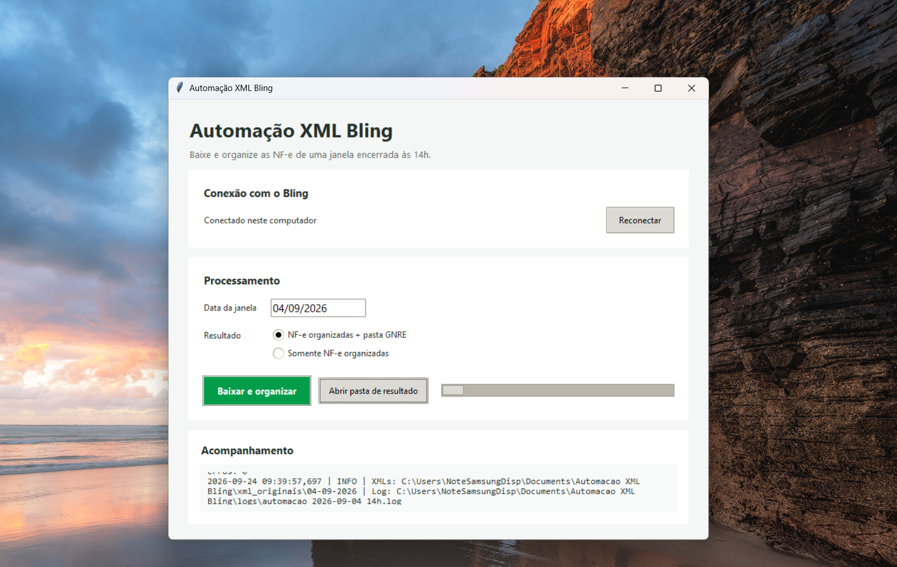

# Automação de XML de NF-e do Bling

Automação em Python para consultar as NF-e emitidas no Bling, baixar os XMLs autorizados e organizá-los em pastas por unidade, marketplace, data de emissão e UF de destino.

Este é um projeto real, desenvolvido para ser utilizado em produção na empresa onde trabalho e atender uma necessidade operacional diária.

O projeto pode operar em uma máquina Windows dedicada ou em um contêiner Docker. Nos dois modos, a execução diária ocorre às **14h10**, considerando a janela encerrada às **14h**.

## Fluxo da automação

1. Consulta as NF-e emitidas na janela diária.
2. Mantém somente notas autorizadas ou com DANFE emitida.
3. Exclui notas canceladas antes do download.
4. Baixa o XML pela chave de acesso.
5. Preserva uma cópia original.
6. Classifica o documento por CNPJ emitente, marketplace, data e UF.
7. Registra a janela concluída para recuperar dias pendentes após uma interrupção.

### Janela diária

Cada execução processa as últimas 24 horas fechadas às 14h:

```text
Dia anterior às 14:00  →  Dia atual às 14:00
```

O início é inclusivo e o final é exclusivo. Por exemplo, a janela identificada como `21-09-2026` contém emissões desde `20-09-2026 14:00:00` até antes de `21-09-2026 14:00:00`.

## Organização dos arquivos

```text
xml_por_cnpj/
└── Matriz ou Filial/
    └── Marketplace/
        ├── DD-MM-AAAA/
        │   └── UF/
        │       └── CHAVE_DA_NFE.xml
        └── GNRE/
            └── DD-MM-AAAA/
                └── UF/
                    └── CHAVE_DA_NFE.xml
```

Quando a UF de destino estiver configurada para a unidade emitente, o XML também recebe uma cópia na pasta `GNRE`. Essa cópia funciona como uma fila operacional e não substitui a classificação principal.

Os XMLs sem classificação também permanecem em:

```text
xml_originais/DD-MM-AAAA/
```

As unidades, os canais do Bling, os CNPJs dos intermediadores e as UFs que exigem GNRE são mapeados no arquivo local `configuracao.json`. Use [`configuracao.example.json`](configuracao.example.json) como modelo; a configuração real não deve ser enviada ao repositório.

## Formas de instalação

Use apenas **uma** forma de execução por vez. Duas instalações ativas podem tentar renovar os mesmos tokens e processar a mesma janela simultaneamente.

### Windows

Indicada para um computador Windows dedicado.

1. Baixe ou clone o repositório em uma pasta fixa.
2. Copie `configuracao.example.json` para `configuracao.json` e preencha os dados reais.
3. Adicione `.env` e `tokens.json` na raiz do projeto.
4. Abra `Instalar automacao.cmd`.
5. Confira a tarefa `Automacao XML Bling - Diario` no Agendador de Tarefas.

O instalador:

- localiza ou instala o Python;
- instala as dependências;
- valida o executor em modo de simulação;
- cria a execução diária para as 14h10;
- configura novas tentativas em caso de falha.

A tela pode permanecer bloqueada, mas o usuário configurado para a tarefa precisa continuar conectado.

### Docker

Requisitos:

- Docker Engine ou Docker Desktop;
- Docker Compose;
- arquitetura `amd64`;
- acesso à internet para a API do Bling.

Copie `configuracao.example.json` para `configuracao.json` e preencha os dados reais. Coloque `.env` na raiz e `tokens.json` dentro de `segredos/`. Em seguida:

```bash
docker compose up -d --build
```

Confira o serviço:

```bash
docker compose logs -f automacao-xml-bling
```

O contêiner inicia junto com o Docker, verifica dias pendentes e agenda as próximas execuções para as 14h10 no fuso `America/Sao_Paulo`.

Comandos úteis:

```bash
# Ver as janelas pendentes sem baixar ou alterar o estado
docker compose exec automacao-xml-bling python executar_diario.py --simular

# Reiniciar
docker compose restart

# Parar
docker compose down
```

## Configuração do Bling

Crie um arquivo `.env` na raiz com as credenciais do aplicativo, sem colocar valores reais no repositório:

```dotenv
BLING_CLIENT_ID=seu_client_id
BLING_CLIENT_SECRET=seu_client_secret
BLING_REDIRECT_URI=http://localhost:8000/callback
```

A URI precisa ser a mesma cadastrada no aplicativo do Bling. Para realizar a autorização OAuth inicial em uma máquina com navegador:

```bash
python autenticar_bling.py
```

O comando cria `tokens.json`. Transfira esse arquivo somente por um meio seguro para a máquina de execução. O programa renova o token automaticamente quando necessário.

> `.env` e `tokens.json` contêm credenciais. Ambos estão protegidos pelo `.gitignore` e nunca devem ser enviados ao GitHub.

## Execução manual

Instale as dependências:

```bash
python -m pip install -r requirements.txt
```

Baixe uma janela específica das 14h:

```bash
python baixar_xmls.py 2026-09-21 --janela-14h
```

Antes das 14h, é possível testar uma janela parcial até o horário atual:

```bash
python baixar_xmls.py 2026-09-21 --janela-14h --ate-agora
```

Execute o controle diário e a recuperação de pendências:

```bash
python executar_diario.py
```

Veja o que seria processado sem baixar arquivos:

```bash
python executar_diario.py --simular
```

Na primeira execução, processe um histórico a partir de uma data determinada:

```bash
python executar_diario.py --primeira-data 2026-09-01
```

`--primeira-data` só é aceito antes da criação de `estado_execucao.json`.

## Aplicativo com interface

O arquivo `app_desktop.py` oferece uma interface para uso manual no Windows. Nela é
possível conectar o computador ao Bling, selecionar a data da janela e escolher entre:



- NF-e organizadas sem cópias na pasta GNRE;
- NF-e organizadas com as cópias adicionais na pasta GNRE.
- somente as GNRE em arquivos ZIP separados por unidade.

No modo de ZIP, os arquivos são criados em `Documentos\Automacao XML
Bling\GNRE - ZIP`, com nomes como `Matriz DD-MM-AAAA.zip` e `Filial
DD-MM-AAAA.zip`. Dentro de cada ZIP, os XMLs ficam separados por marketplace e
UF. Esse modo não cria a cópia principal das NF-e na estrutura organizada; os
XMLs originais continuam preservados.

Para testar a interface pelo código-fonte:

```powershell
py -3.14 app_desktop.py
```

Para gerar o executável, instale o PyInstaller e execute o script de compilação:

```powershell
py -3.14 -m pip install pyinstaller
.\compilar_aplicativo.ps1
```

O pacote é criado em `dist/Entrega-Automacao-XML-Bling`. Por segurança, ele nunca
inclui `tokens.json`. No computador de destino, coloque `.env` e
`configuracao.json` ao lado do executável e use o botão **Conectar ao Bling** na
primeira abertura. A opção `-IncluirConfiguracaoLocal` copia os dois arquivos de
configuração para a entrega, mas deve ser usada somente quando o pacote for enviado
por um meio seguro.

No executável, os tokens ficam em `%LOCALAPPDATA%\Automacao XML Bling` e os XMLs,
logs e resultados ficam em `Documentos\Automacao XML Bling`.

## Logs e acompanhamento

Os principais arquivos de acompanhamento são:

| Arquivo | Conteúdo |
|---|---|
| `logs/executor_diario.log` | Inicialização, pendências, sucessos e falhas do executor |
| `logs/automacao_AAAA-MM-DD_14h.log` | Resultado detalhado de cada janela |
| `estado_execucao.json` | Última janela concluída e data da atualização |

No Docker, esses arquivos ficam dentro de `dados/`. Em uma instalação organizada para Windows, também podem ficar na pasta compartilhada `dados/`.

O estado só avança depois que uma janela termina com sucesso. Se a máquina ficar desligada, a próxima execução processa as janelas pendentes em ordem e interrompe no primeiro erro.

## Testes

Execute os testes automatizados com:

```bash
python -m unittest -v
```

## Principais arquivos

| Arquivo | Função |
|---|---|
| `baixar_xmls.py` | Consulta as notas, filtra as situações e baixa os XMLs |
| `organizar_xmls.py` | Classifica os XMLs na estrutura de pastas |
| `executar_diario.py` | Controla estado, pendências e execução exclusiva |
| `agendador_docker.py` | Agenda e repete execuções dentro do contêiner |
| `bling_auth.py` | Carrega e renova os tokens OAuth |
| `autenticar_bling.py` | Realiza a autorização OAuth inicial |
| `configuracao.example.json` | Modelo anonimizado da configuração de unidades, canais e intermediadores |

## Segurança

- Não registre credenciais em código ou documentação.
- Não envie `.env`, `tokens.json`, XMLs ou logs ao repositório.
- Mantenha somente uma instalação ativa.
- Restrinja o acesso às pastas de dados e segredos na máquina de execução.
